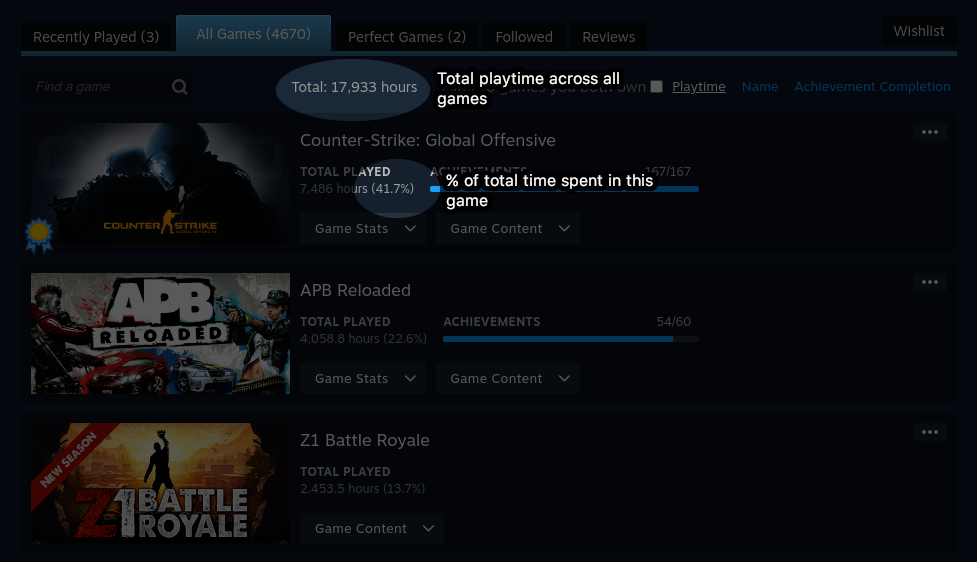

# SteamPTP

SteamPTP is a Chrome extension that displays playtime percentage in Steam profiles.

## Installation

1. Clone this repository.
2. Open the [chrome://extensions](chrome://extensions) page.
3. Turn on the `Developer mode`.
4. Click the `Load unpacked` button and select the cloned directory.

## License
[GPL-3.0](LICENSE)
